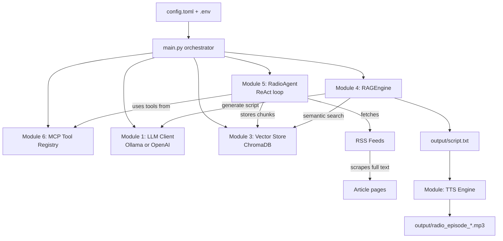

# AI Tech Radio — How It Works

A plain-English map of the whole project: what it does, where every piece lives,
how data flows through the pipeline, and where you could take it next.

---

## 1. What this app actually does

It's a pipeline that automatically produces a short "radio episode" about recent
AI/React/JS news, with **zero manual writing**:

```
RSS feeds  →  scrape full articles  →  store as searchable knowledge  →
retrieve the most relevant bits  →  ask an LLM to write a script  →
convert the script to speech (mp3)
```

Every run of `python main.py` does all of this end-to-end.

---

## 2. The big picture (pipeline flow)



**Key idea:** every "Module" from the original workshop maps to one Python
package/file. Nothing is duplicated — `main.py` just wires them together in order.

---

## 3. File map — what lives where

```
ai-radio-station/
├── main.py                        ← entry point, orchestrates everything (run this)
├── config.toml                    ← ALL tunable settings (provider, topics, feeds, RAG params)
├── .env                           ← secrets (OPENAI_API_KEY) — never committed
├── requirements.txt               ← Python dependencies
│
├── ai_radio/                      ← the actual application package
│   ├── config.py                  ← loads config.toml + .env into a typed AppConfig object
│   │
│   ├── llm/                       ← Module 1: LLM providers (swappable)
│   │   ├── base.py                ← shared interface (LLMClient) + mock script fallback
│   │   ├── ollama_client.py       ← talks to local Ollama (http://localhost:11434)
│   │   ├── openai_client.py       ← talks to OpenAI's API (needs OPENAI_API_KEY)
│   │   └── factory.py             ← picks the right client based on config.llm.provider
│   │
│   ├── retrieval/                 ← Modules 3 + 4: storage & retrieval
│   │   ├── vector_store.py        ← ChromaDB wrapper: chunking, embedding, semantic search
│   │   └── rag_engine.py          ← Retrieval-Augmented Generation: query→retrieve→write script
│   │
│   ├── agents/                    ← Modules 5 + 6: autonomous collection
│   │   ├── radio_agent.py         ← the ReAct agent that fetches/scrapes/indexes RSS news
│   │   └── tool_registry.py       ← MCP-style registry: makes agent capabilities discoverable
│   │
│   ├── audio/
│   │   └── tts_engine.py          ← converts the final script to an mp3 (gTTS/pyttsx3/say)
│   │
│   ├── tools/
│   │   └── inspect_db.py          ← standalone CLI to peek inside the vector database
│   │
│   └── training/                  ← Module 2: optional LoRA fine-tuning demo (separate, not in main flow)
│
└── output/                        ← generated scripts + mp3s land here
```

---

## 4. Walking through a real run, step by step

This is literally what happens when you run `python main.py --skip-fetch`:

### Step 0 — Configuration (`ai_radio/config.py`)

- Reads `config.toml` (provider, model, topics, RSS feed list, RAG tuning knobs).
- Loads `.env` (via `python-dotenv`) so `OPENAI_API_KEY` is available as an env var.
- Produces one typed `AppConfig` object that every other module receives — **this
  is the single source of truth**. Change behavior by editing `config.toml`, not code.

### Step 1 — MCP Tool Registry (`agents/tool_registry.py`)

- An empty registry (`MCPRegistry`) is created. Think of it as a phone book of
  "capabilities" the agent can call by name, each with a declared schema
  (inputs/outputs) — this is what "Module 6: MCP" means here. It's a simplified,
  local stand-in for the real Model Context Protocol.

### Step 2 — LLM client (`llm/factory.py` + `llm/*_client.py`)

- `LLMClientFactory.from_config(config.llm)` returns either an `OllamaClient` or
  `OpenAIClient` — same interface (`generate()`, `chat()`), so the rest of the app
  doesn't care which one it's talking to.
- `ensure_available()` checks connectivity (pings Ollama, or checks for an API key
  - the `openai` package). If unavailable, it silently switches to **mock mode**
    and returns a canned placeholder script later — this is why your first script
    looked suspiciously short and generic (see §6).

### Step 3 — Vector store init (`retrieval/vector_store.py`)

- Opens (or creates) a ChromaDB database on disk at `chroma_data/`.
- Uses the `all-MiniLM-L6-v2` sentence-transformer model to turn text into
  384-dimensional vectors ("embeddings") — this is what enables _semantic_
  search (searching by meaning, not exact keywords).
- `--reset-db` wipes this database clean before continuing.

### Step 4 — News collection (`agents/radio_agent.py`) — **skipped by `--skip-fetch`**

This is the ReAct agent (Reason → Act → Observe loop), registered as MCP tools:

1. **Fetch**: for each feed in `config.toml`, downloads the RSS/Atom XML
   (`requests`, 10s timeout) → parses entries (`feedparser`).
2. **Scrape**: for every article link found, fetches the full page and extracts
   clean article text (`trafilatura`), running up to 8 fetches **concurrently**
   per feed (`ThreadPoolExecutor`, 8s timeout each) — this is the Phase 1
   performance optimization we added.
3. **Store**: all collected articles are chunked (see §5) and embedded into
   ChromaDB via the `store_articles` tool.
4. Logs every tool call (success/failure/latency) for observability.

### Step 5 — RAG script generation (`retrieval/rag_engine.py`)

Four sub-steps, printed live when you run it:

1. **Query expansion** — asks the LLM to generate a handful of extra search
   queries related to your configured topics (better recall than one query).
2. **Retrieval** — runs semantic search for each query against ChromaDB, dedupes
   identical chunks, and caps how many chunks can come from any single article
   (`max_chunks_per_article`) so one long article can't dominate.
3. **Context assembly** — formats the top N retrieved chunks into a structured
   block: title, source, snippet.
4. **Generation** — sends a system prompt (persona + rules) + the context block
   to the LLM, which writes the actual script.

### Step 6 — Save + TTS (`main.py` + `audio/tts_engine.py`)

- Script is saved to `output/script.txt`.
- Unless `--no-audio`, it's converted to speech (`gTTS` if online, `pyttsx3` or
  macOS `say` as offline fallbacks) and saved as `output/radio_episode_TIMESTAMP.mp3`.
- On macOS, the mp3 auto-plays via `afplay`.

---

## 5. Chunking, explained simply

An article is too long to embed as one vector (it would blur together every topic
mentioned). So it's split into overlapping "chunks" (~150 words each, 30-word
overlap by default — tunable in `config.toml`):

- `vector_store.py` tries **sentence-aware chunking** first (via `nltk`): it
  groups whole sentences together up to the word budget, so chunks never cut a
  sentence in half.
- If `nltk` isn't available, it silently falls back to a simple word-count sliding
  window (same behavior as before, just less clean at the edges).

Overlap exists so that a concept split across a chunk boundary is still findable —
e.g. "GPT-5 ... [chunk boundary] ... was released today" wouldn't be lost.

---

## 6. Config vs. secrets — two separate files, on purpose

| File          | Contains                                                 | Committed to git?    |
| ------------- | -------------------------------------------------------- | -------------------- |
| `config.toml` | Provider name, model name, topics, RSS feeds, RAG tuning | ✅ Yes               |
| `.env`        | `OPENAI_API_KEY` (the actual secret)                     | ❌ No (`.gitignore`) |

This split means you can safely share/commit `config.toml` (it documents _how_
the app is configured) while `.env` never leaves your machine.

---

## 7. Mock mode — why scripts sometimes look fake/short

If the configured provider is unreachable (Ollama not running, or no
`OPENAI_API_KEY` set), `LLMClient.ensure_available()` sets `_mock_mode = True`.
From then on, **every** `generate()`/`chat()` call returns the exact same
hardcoded ~140-word paragraph (`MOCK_SCRIPT` in `llm/base.py`) — regardless of
what was actually retrieved from the vector store. It exists purely so the rest
of the pipeline (TTS, file saving, etc.) is demoable without any live LLM.
**A short/generic script is always a sign you're in mock mode**, not a bug in
retrieval.

---

## 8. CLI flags cheat-sheet (`main.py`)

| Flag                        | Effect                                                                                                              |
| --------------------------- | ------------------------------------------------------------------------------------------------------------------- |
| _(none)_                    | Full run: fetch fresh news, index, generate script + audio via the configured provider                              |
| `--mock`                    | Force mock mode — no LLM call, canned script, useful for testing plumbing                                           |
| `--no-audio`                | Skip TTS — faster iteration, text-only output                                                                       |
| `--reset-db`                | Wipe the vector store before running (fresh index)                                                                  |
| `--skip-fetch`              | Reuse the existing vector store, skip RSS/scraping entirely (fastest — good for repeated script-generation testing) |
| `--provider ollama\|openai` | Override `config.toml`'s `llm.provider` for this run                                                                |
| `--model NAME`              | Override `config.toml`'s `llm.model` for this run                                                                   |

---

## 9. Ideas for improvement (things worth thinking about)

Roughly ordered by effort vs. impact:

- **Parallelize the outer feed loop too.** Right now, the 11 RSS feeds are fetched
  one at a time in `radio_agent.py`'s `collect_and_index_news()` — only the
  per-article scraping _within_ a feed is concurrent. Wrapping the whole feed
  loop in a `ThreadPoolExecutor` too would meaningfully cut total collection time.
- **Cache/skip already-seen articles across runs by date**, not just by URL — right
  now an old article stays in the DB forever unless you `--reset-db`; a
  time-window filter (e.g., "only articles from the last 7 days") would keep the
  knowledge base fresh automatically.
- **Let the LLM's query-expansion / decision steps actually influence which feeds
  get fetched** — right now `_llm_decide()` exists but its output isn't fed back
  into the fetch loop; it's evaluated but not actionable yet.
- **Add a genuinely free LLM provider** (e.g. Groq, Google Gemini free tier) —
  the `LLMClient` base class + `factory.py` were built exactly for this; adding a
  new provider is copy-`openai_client.py`-and-adjust.
- **Surface RAG quality metrics** — e.g. log the average similarity score of
  retrieved chunks per run, so you can tell when retrieval quality drops (bad
  topics, empty DB, etc.) without reading logs manually.
- **Longer/more structured scripts** — bump the ~300-word target in
  `SYSTEM_PROMPT_TEMPLATE` (`rag_engine.py`) now that you're using a stronger
  model, and/or ask for named sections (headline, deep-dive, quick-hits).
- **Automated scheduling** — wrap `main.py` in a cron job / `launchd` plist to
  generate a fresh episode daily without manual runs.
- **Tests** — there currently aren't any automated tests; even a handful of
  unit tests for `_chunk_text()`, `_retrieve()`'s diversity capping, and the
  config loader would catch regressions early.

---

## 10. Quick reference — running it

```bash
cd ai-radio-station
source .venv/bin/activate

# First time / after changing feeds: fetch fresh + index + generate script (no audio)
python main.py --reset-db --no-audio

# Fast iteration afterwards — reuse existing knowledge base
python main.py --skip-fetch --no-audio

# Full experience with audio
python main.py --skip-fetch

# Inspect what's actually stored in the vector DB
python -m ai_radio.tools.inspect_db
python -m ai_radio.tools.inspect_db --search "react hooks"
```
