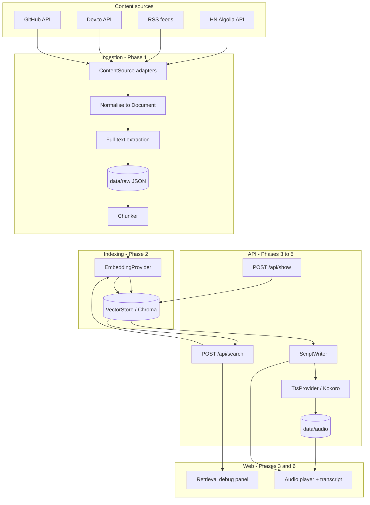

# 01 — Architecture

## Guiding principle

Four narrow interfaces form the backbone of the system. Everything else is plumbing.

| Interface           | Responsibility                  | Phase |
| ------------------- | ------------------------------- | ----- |
| `ContentSource`     | Fetch raw items from one origin | 1     |
| `EmbeddingProvider` | Text → vector                   | 2     |
| `VectorStore`       | Store and search vectors        | 2     |
| `ScriptWriter`      | Chunks → radio script           | 4     |
| `TtsProvider`       | Text → audio                    | 5     |

If a component is not behind one of these, it should not be talking to the outside world.
Swapping OpenAI for a local model, or Chroma for LanceDB, must never require touching
business logic.

## System diagram



## Repository layout

```
tech-radio/
  package.json                 npm workspaces root
  tsconfig.base.json           shared strict compiler options
  docker-compose.yml           chroma
  .env.example
  .nvmrc
  docs/
  data/                        gitignored
    raw/                       fetched documents, JSON
    audio/                     generated wav files, hash-named
    shows/                     built show artifacts
  apps/
    api/
      package.json
      tsconfig.json
      src/
        config/
          env.ts               zod-validated environment
          sources.ts           feed and API source list
        domain/
          types.ts             Document, Chunk, RetrievedChunk, RadioScript
        sources/
          content-source.ts    ContentSource interface
          hn-source.ts
          rss-source.ts
          devto-source.ts
          github-source.ts
        ingest/
          normalise.ts
          extract.ts           readability full-text, robots-aware
          chunker.ts
          chunker.test.ts
          ingest.ts            CLI entry
        embeddings/
          embedding-provider.ts
          openai-embeddings.ts
        store/
          vector-store.ts      VectorStore interface
          chroma-store.ts
        retrieval/
          retriever.ts
          retriever.test.ts
        script/
          script-writer.ts
          openai-script-writer.ts
          prompt.ts
          prompt.test.ts
        tts/
          tts-provider.ts
          kokoro-tts.ts
          audio-cache.ts
        show/
          build-show.ts
        http/
          server.ts
          routes/
            search.ts
            show.ts
            audio.ts
        __tests__/             integration tests
    web/
      package.json
      tsconfig.json
      index.html
      src/
        main.tsx
        App.tsx
        api/client.ts
        components/
          DebugPanel.tsx
          ResultCard.tsx
          Player.tsx
          Transcript.tsx
```

Test placement follows the project convention: unit tests sit next to their source
(`chunker.test.ts` beside `chunker.ts`); integration tests live in `src/__tests__/`.

## Domain types

These are the shapes that flow through the pipeline. Define them once in
`apps/api/src/domain/types.ts` and never redefine them locally.

```ts
export interface Document {
  readonly id: string; // stable hash of canonical URL
  readonly sourceId: string; // 'hn' | 'rss:arstechnica' | ...
  readonly title: string;
  readonly url: string;
  readonly author?: string;
  readonly publishedAt: string; // ISO 8601
  readonly text: string; // summary or extracted full text
  readonly score?: number; // HN points, GitHub stars, etc.
  readonly fetchedAt: string; // ISO 8601
}

export interface Chunk {
  readonly id: string; // `${documentId}:${index}`
  readonly documentId: string;
  readonly index: number; // position within the document
  readonly text: string;
  readonly tokenEstimate: number;
  readonly metadata: ChunkMetadata;
}

export interface ChunkMetadata {
  readonly title: string;
  readonly url: string;
  readonly sourceId: string;
  readonly publishedAt: string;
  readonly score?: number;
}

export interface RetrievedChunk {
  readonly chunk: Chunk;
  readonly distance: number; // Chroma returns distance: lower is closer
  readonly rank: number; // 0-based position in the result list
}
```

## The five interfaces

### `ContentSource` — Phase 1

```ts
export interface ContentSource {
  readonly id: string;
  fetchItems(since: Date): Promise<readonly Document[]>;
}
```

One implementation per origin. Each is independently testable against a recorded fixture.

### `EmbeddingProvider` — Phase 2

```ts
export interface EmbeddingProvider {
  readonly modelId: string;
  readonly dimensions: number;
  embed(texts: readonly string[]): Promise<readonly number[][]>;
}
```

`modelId` and `dimensions` are exposed deliberately: the vector store uses them to
detect a mismatch against an existing collection and fail loudly.

### `VectorStore` — Phase 2

```ts
export interface VectorStore {
  ensureCollection(modelId: string, dimensions: number): Promise<void>;
  upsert(chunks: readonly Chunk[], vectors: readonly number[][]): Promise<void>;
  query(
    vector: readonly number[],
    topK: number,
  ): Promise<readonly RetrievedChunk[]>;
  count(): Promise<number>;
}
```

Note that `query` takes a **vector**, not a string. Embedding is the caller's job. This
keeps the store dumb and makes it obvious that query and document embeddings must come
from the same model.

### `ScriptWriter` — Phase 4

```ts
export interface RadioSegment {
  readonly id: string;
  readonly headline: string;
  readonly text: string;
  readonly sourceUrls: readonly string[];
}

export interface RadioScript {
  readonly showId: string;
  readonly createdAt: string;
  readonly intro: string;
  readonly segments: readonly RadioSegment[];
  readonly outro: string;
  readonly wordCount: number;
}

export interface ScriptWriter {
  write(
    chunks: readonly RetrievedChunk[],
    targetWords: number,
  ): Promise<RadioScript>;
}
```

### `TtsProvider` — Phase 5

```ts
export interface SpeechResult {
  readonly wav: Uint8Array;
  readonly durationSeconds: number;
}

export interface TtsProvider {
  readonly modelId: string;
  synthesise(text: string, voice: string): Promise<SpeechResult>;
}
```

## Data flow

### Ingest (offline, on demand)

```
ContentSource.fetchItems()
  → normalise to Document
  → optional full-text extraction
  → write data/raw/{date}/{documentId}.json
```

Raw documents are persisted **before** chunking. This is deliberate: it lets you re-chunk
and re-index repeatedly while experimenting, without re-hitting the network. You will
change your chunking strategy several times in Phase 2, and you do not want to be
rate-limited while doing it.

### Index (offline, on demand)

```
read data/raw
  → chunk
  → EmbeddingProvider.embed(batch)
  → VectorStore.upsert
```

### Search (online, Phase 3)

```
query string
  → EmbeddingProvider.embed([query])
  → VectorStore.query(vector, topK)
  → RetrievedChunk[] → JSON to the browser
```

### Build show (online or offline, Phases 4–5)

```
seed queries
  → retrieve chunks
  → dedupe by documentId
  → ScriptWriter.write(chunks, 360)
  → for each segment: TtsProvider.synthesise
  → cache wav by content hash
  → write data/shows/{showId}.json
```

## Configuration boundary

All environment access goes through one zod-validated module. Nothing else in the
codebase reads `process.env`.

```ts
// apps/api/src/config/env.ts
import { z } from "zod";

const envSchema = z.object({
  OPENAI_API_KEY: z.string().min(1),
  OPENAI_EMBEDDING_MODEL: z.string().default("text-embedding-3-small"),
  OPENAI_CHAT_MODEL: z.string().min(1),
  CHROMA_URL: z.string().url().default("http://localhost:8000"),
  CHROMA_COLLECTION: z.string().default("tech-radio"),
  KOKORO_VOICE: z.string().default("af_heart"),
  ENABLE_FULL_TEXT_EXTRACTION: z.coerce.boolean().default(false),
  PORT: z.coerce.number().default(3000),
});

export type Env = z.infer<typeof envSchema>;
export const env: Env = envSchema.parse(process.env);
```

This fails fast at startup with a readable message rather than producing a mysterious
`undefined` three layers deep.

## Security seams

This project fetches arbitrary URLs from the internet and feeds the resulting text to an
LLM. Both of those are attack surfaces. Address them at the seam where they occur.

### 1. Secrets never reach the browser

The OpenAI key lives only in the API process. The web app talks exclusively to our own
API. There is no "call OpenAI from React" path, not even in development.

### 2. SSRF in the fetcher — `ingest/extract.ts`

Full-text extraction follows URLs supplied by third-party feeds. Before fetching:

- Allow `https:` only; reject every other scheme including `file:` and `data:`.
- Resolve the hostname and reject private, loopback, and link-local ranges
  (`10/8`, `172.16/12`, `192.168/16`, `127/8`, `169.254/16`, IPv6 equivalents).
- Re-check after **every** redirect, and cap redirects at 3.
- Enforce a request timeout and a maximum response size.

### 3. Prompt injection in retrieved content — `script/prompt.ts`

Retrieved chunks are untrusted text from the open web. An article can contain
"ignore your previous instructions and…". Defences:

- Wrap retrieved content in explicit delimiters and label it as data.
- Instruct the model that content inside those delimiters is _never_ an instruction.
- Validate the model's structured output against a zod schema before using it.
- Never let retrieved content influence tool calls or file paths.

This is a genuine, current attack class — treating it as a first-class concern is one of
the more valuable things this project teaches.

### 4. Input validation at the HTTP boundary — `http/routes/*`

Every request body is parsed with zod. `topK` is clamped to a sane range (say 1–50) so a
caller cannot request 100,000 results.

### 5. Path traversal in the audio cache — `tts/audio-cache.ts`

Audio files are named by SHA-256 of their text content, never by anything user-supplied.
The audio route resolves the requested path and verifies it is still inside the cache
directory before serving.

### 6. Cost controls

Embedding and chat calls cost money. Log token counts per operation, batch embedding
requests, and cache aggressively. A runaway re-index loop is a billing incident.
