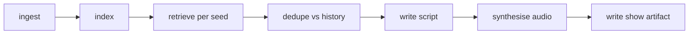

# Phase 7 — Show Orchestration

## Goal

One command that goes from "nothing" to "today's show is ready to play", with
cross-episode deduplication so the same story is not covered twice.

## Why now

Every stage works individually. This phase makes the project usable daily rather than as a
sequence of manual steps.

## Deliverables

- `npm run show:build` running the full pipeline
- Show artifacts written to `data/shows/{showId}.json`
- Cross-episode story deduplication
- Idempotent, resumable builds
- Show history endpoint and a frontend show picker
- Optional scheduled build

## The pipeline



Each stage is already implemented. This phase composes them and adds the two things that
only matter once you run it repeatedly: **deduplication across episodes** and
**resumability**.

## Steps

### 1. The build command

```bash
npm run show:build                    # today, full pipeline
npm run show:build -- --skip-ingest   # reuse today's raw documents
npm run show:build -- --date 2026-07-30
npm run show:build -- --dry-run       # script only, no audio
```

`--dry-run` matters more than it sounds. Iterating on the Phase 4 prompt means running
this repeatedly, and you do not want to spend a minute of CPU on TTS each time to read
360 words of text.

### 2. Cross-episode deduplication

The most important addition in this phase.

Without it, a story that trends on HN for three days appears in three consecutive shows,
and the radio station sounds broken.

Maintain `data/shows/history.json`:

```ts
export interface AiredStory {
  readonly documentId: string;
  readonly canonicalUrl: string;
  readonly headline: string;
  readonly showId: string;
  readonly airedAt: string;
}
```

Exclude any `documentId` aired in the last **N days** (start with 7) from retrieval
results before passing chunks to the writer.

Two refinements worth adding:

- **Near-duplicate detection.** The same story from Ars Technica and The Verge has two
  different `documentId`s. Compare the new candidate's embedding against aired stories'
  embeddings and exclude anything below ~0.15 cosine distance. This is a genuinely
  satisfying use of the vector store for something other than retrieval.
- **Follow-up allowance.** If a story aired but its score has grown substantially, allow
  it back as a "developing story". Optional, but it is what a real news show does.

### 3. Idempotency and resumability

Building a show involves paid API calls and slow CPU work. A crash at the TTS stage must
not force a re-run of ingestion and embedding.

Write the artifact incrementally with a status field:

```ts
export interface ShowBuildState {
  readonly showId: string;
  readonly stage:
    | "ingested"
    | "indexed"
    | "scripted"
    | "synthesised"
    | "complete";
  readonly script?: RadioScript;
  readonly parts?: readonly ShowAudioSegment[];
  readonly errors: readonly string[];
}
```

On restart, resume from the recorded stage. Combined with the Phase 5 content-hash cache,
re-running after a failure is cheap.

### 4. Show artifact

```json
{
  "showId": "2026-07-31",
  "createdAt": "2026-07-31T06:00:00Z",
  "totalDurationSeconds": 138,
  "parts": [
    {
      "id": "intro",
      "kind": "intro",
      "text": "Good morning, it's Friday...",
      "sourceUrls": [],
      "audioHash": "a3f2...",
      "durationSeconds": 6.2,
      "voice": "af_heart"
    }
  ],
  "meta": {
    "seedQueries": ["..."],
    "documentsConsidered": 141,
    "documentsExcludedAsAired": 12,
    "chunksRetrieved": 22,
    "embeddingTokens": 137204,
    "chatTokens": 4821,
    "buildDurationSeconds": 94
  }
}
```

The `meta` block is deliberately verbose. Comparing it across shows is how you notice that
retrieval quietly degraded, or that yesterday's build burned four times the tokens.

### 5. Guardrails

The build must fail loudly rather than produce a bad show:

| Condition                                            | Action                                     |
| ---------------------------------------------------- | ------------------------------------------ |
| Fewer than 3 usable documents after dedupe           | Abort with a clear message                 |
| Every seed query returns nothing under `maxDistance` | Abort — likely an indexing problem         |
| Script fails zod validation twice                    | Abort                                      |
| Total duration under 90 seconds                      | Warn loudly; suggest raising `targetWords` |
| A segment cites an unretrieved URL                   | Abort — possible injection                 |

An automated pipeline that silently produces garbage is worse than one that stops.

### 6. History endpoints

```
GET /api/shows              → [{ showId, createdAt, totalDurationSeconds, headlines }]
GET /api/show/:showId
GET /api/show/latest
```

Add a simple show picker to the Radio tab so you can play back previous episodes. It takes
very little code and makes the deduplication work visible — you can hear that consecutive
shows cover different stories.

### 7. Scheduling (optional)

Simplest thing that works: a `launchd` plist on macOS, or `cron`, running
`npm run show:build` each morning. Do not build an in-process scheduler — a long-running
Node process holding a cron loop is more failure modes than a cron entry.

Log to `data/shows/build.log` and check the exit code.

## How to verify

```bash
rm -rf data/shows
npm run show:build
```

Then, on the same day:

```bash
npm run show:build -- --skip-ingest
```

The second show must cover **different stories** than the first. That is the dedupe test,
and it is the one that proves this phase works.

Also verify:

- Killing the build mid-TTS and restarting resumes rather than restarting.
- `--dry-run` produces a script with no audio files.
- The `meta` block is populated and plausible.
- A show with an artificially cleared index aborts with a clear message.

## Learning checkpoints

- Why does cross-episode dedupe need embeddings, not just URL matching?
- Why persist build stage rather than running the pipeline as one transaction?
- Which guardrail would have caught the worst failure you have hit so far?
- What does the `meta` block tell you when comparing two consecutive shows?

## Risks and gotchas

| Risk                                   | Mitigation                                                  |
| -------------------------------------- | ----------------------------------------------------------- |
| Same story on consecutive days         | History file + embedding-based near-dupe check              |
| Crash forces full expensive rebuild    | Staged artifact + content-hash cache                        |
| Silent bad show from a scheduled run   | Guardrails abort; check exit codes                          |
| History file grows unbounded           | Prune beyond 90 days                                        |
| Concurrent builds corrupt the artifact | Lock file, or just do not run two                           |
| Timezone confusion in `showId`         | Fix a timezone explicitly; do not use local time implicitly |

## Done criteria

- [ ] `npm run show:build` runs end to end from nothing to playable
- [ ] Two builds on the same day produce different stories
- [ ] Interrupting and restarting resumes from the last completed stage
- [ ] `--dry-run` and `--skip-ingest` work
- [ ] Show artifacts include a populated `meta` block
- [ ] All six guardrails are implemented and at least two verified by forcing the condition
- [ ] The frontend can list and play previous shows
